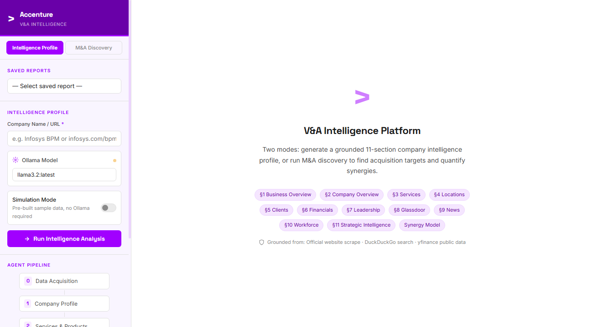
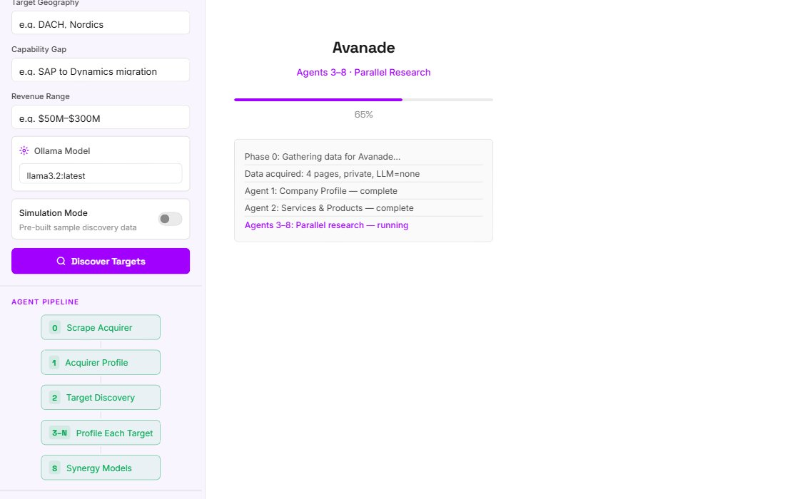
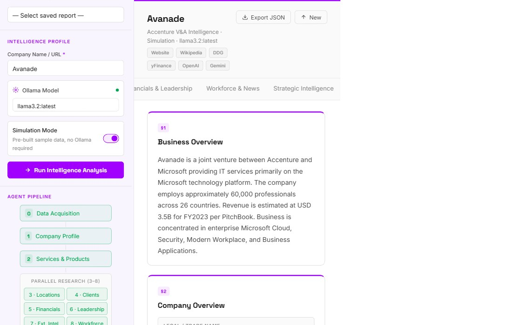
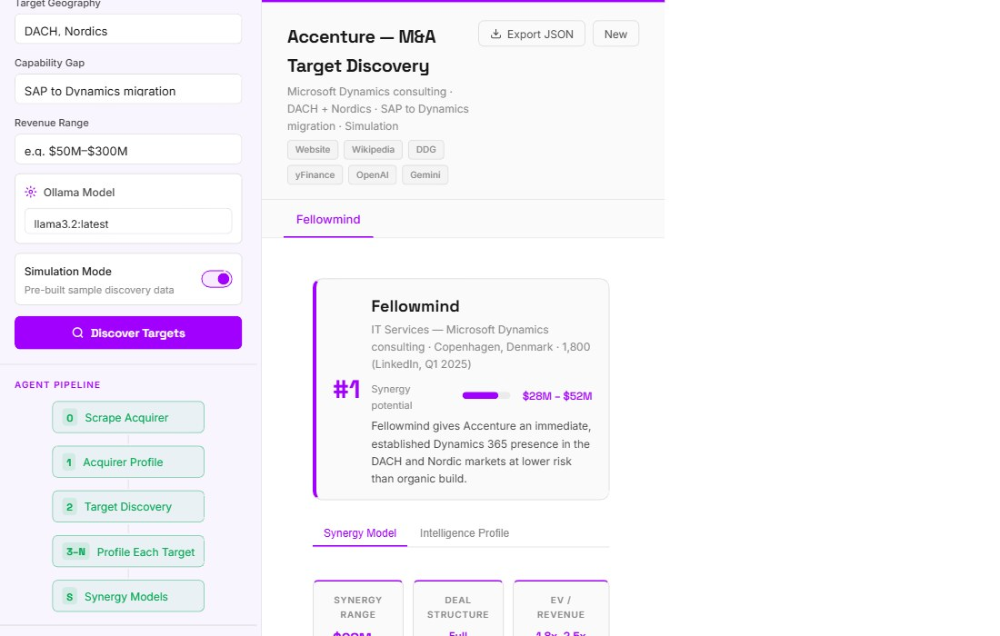

# Accenture V&A Intelligence Platform

> **What is this?** A private research assistant that automatically builds deep intelligence reports on any company — or finds the best acquisition targets for a given deal thesis — using AI agents that scour the web, financial filings, and news in minutes, not days.

---

## At a Glance

When Accenture's Ventures & Acquisitions team evaluates a potential deal, analysts traditionally spend days manually gathering information: reading company websites, pulling financial data, sifting through news, and piecing together a picture of the target. This platform does all of that automatically.

You type a company name. Ten AI agents go to work in parallel — visiting the company's website, pulling stock data, reading Wikipedia, scanning SEC filings, searching recent news — and within a few minutes produce a structured, 11-section intelligence report grounded in real sources.

There are **two modes**:

| Mode | What you give it | What you get back |
|------|-----------------|-------------------|
| **Intelligence Profile** | A company name or URL | An 11-section deep-dive report on that company |
| **M&A Discovery** | Your acquisition thesis (sector, geography, capability gap) | A ranked list of acquisition targets with a full synergy model |

---

## Screenshots

### 1 · The Home Screen



The left sidebar is your control panel. You pick a mode, type a company name, and hit **Run**. The right side shows your results. Nothing else to it.

---

### 2 · Analysis in Progress



Once you hit **Run**, the platform shows you exactly what is happening in real time. Each row in the log is one AI agent reporting back: *"I read the company website,"* *"I pulled their financial data,"* *"I found 3 relevant news stories."* The progress bar fills as agents complete.

---

### 3 · The Intelligence Report — Overview Tab



The finished report is organized into tabs across the top. The **Overview** tab gives you the headline picture: what the company does, how big it is, where it operates, and what makes it strategically interesting to Accenture.

---

### 4 · Strategic Intelligence (Section 11)


The last section is the most important for deal teams: a SWOT analysis, competitive positioning, potential red flags, and a clear articulation of *why* (or why not) Accenture should consider this target.

---

### 5 · M&A Discovery Results



In **M&A Discovery** mode, you describe what you're looking for — for example *"Microsoft Dynamics consulting firms in the DACH and Nordic regions with SAP-to-Dynamics migration capability"* — and the platform returns ranked targets with deal rationale and a synergy model showing projected revenue upside.

---

## What the Report Contains

An Intelligence Profile produces **11 sections**, organized across 6 tabs:

**Overview tab**
- §1 Business Summary — one-paragraph description of what the company does
- §2 Company Overview — founding history, size, ownership structure

**Services & Products tab**
- §3 Services & Solutions — what they sell, to whom, and how
- §4 Technology Stack — platforms, tools, IP, proprietary products

**Footprint & Clients tab**
- §5 Global Locations — offices, delivery centers, headcount by region
- §6 Key Clients — named clients, industries served, contract patterns

**Financials & Leadership tab**
- §7 Financial Overview — revenue, growth, EBITDA, funding rounds
- §8 Leadership Team — C-suite profiles and backgrounds

**Workforce & News tab**
- §9 Glassdoor & Culture — employee sentiment, retention signals, culture flags
- §10 Recent News — M&A activity, partnerships, controversies, strategy shifts

**Strategic Intelligence tab**
- §11 Strategic Assessment — SWOT, deal rationale, risks, Accenture fit score

---

## How the AI Pipeline Works

Under the hood, the platform runs **10 specialized AI agents** in sequence. Think of it like a team of analysts, each with a specific job:

```
Agent 0 · Data Acquisition
    └─ Fetches raw data from: Company website, Wikipedia,
       DuckDuckGo search, SEC EDGAR, yfinance stock data
       
Agent 1 · Company Profile
Agent 2 · Services & Products
    (run sequentially to build the base picture)

Agents 3–8 · Parallel Research Team
    ├─ Agent 3 · Locations & Footprint
    ├─ Agent 4 · Clients & Relationships  
    ├─ Agent 5 · Financial Analysis
    ├─ Agent 6 · Leadership Profiles
    ├─ Agent 7 · External Intelligence (news, Glassdoor)
    └─ Agent 8 · Workforce & Culture

Agent 9 · Strategic Intelligence
    └─ Synthesizes all prior agent outputs into
       the final SWOT, deal rationale, and fit score
```

Each agent is **instructed to cite sources** and avoid marketing language. If a data point can't be verified from the fetched content, the agent says so rather than making something up.

---

## Setup

### What You Need

- **Python 3.11+** — the programming language this runs on
- **Ollama** — a free tool that runs AI models on your own computer (no cloud, no API bill)
- The `llama3.2:latest` model downloaded via Ollama

### Step 1 — Install Ollama

Download from [ollama.com](https://ollama.com) and install it. Then open a terminal and run:

```
ollama pull llama3.2:latest
```

This downloads the AI model (about 2 GB). You only need to do this once.

### Step 2 — Install Python dependencies

In the project folder, open a terminal and run:

```
pip install -r requirements.txt
```

### Step 3 — (Optional) Add API keys

Open `config.py` and paste in any API keys you have. The platform works without them — Ollama handles the AI locally — but adding keys unlocks additional data sources:

```python
OPENAI_API_KEY = ""   # Optional — OpenAI models
GOOGLE_API_KEY = ""   # Optional — Gemini models
NVIDIA_API_KEY = ""   # Optional — NVIDIA NIM endpoints
```

### Step 4 — Start the server

```
python -m uvicorn main:app --host 0.0.0.0 --port 8083 --reload
```

Then open your browser and go to: **http://localhost:8083**

---

## How to Use It

### Running an Intelligence Profile

1. Make sure **Intelligence Profile** is selected in the top of the left sidebar (it's the default)
2. Type a company name in the **Company Name / URL** field — e.g. `Infosys BPM` or `infosys.com/bpm`
3. The Ollama model is pre-selected (`llama3.2:latest`). Leave it as-is
4. Click **Run Intelligence Analysis**
5. Watch the live progress log. A full report takes **3–8 minutes** depending on your hardware
6. When complete, use the tabs across the top of the report to navigate sections

**Tip:** Reports are saved automatically. Use the **Saved Reports** dropdown at the top of the sidebar to reload any previous report without re-running the analysis.

### Running M&A Discovery

1. Click **M&A Discovery** in the mode toggle at the top of the sidebar
2. Fill in the three fields:
   - **Acquirer** — which Accenture entity or business group is doing the acquiring
   - **Sector / Capability** — what type of company you're looking for (e.g. *Microsoft Dynamics consulting*)
   - **Geography** — target markets (e.g. *DACH, Nordics*)
   - **Capability Gap** — what specific skill or asset Accenture needs (e.g. *SAP to Dynamics migration*)
3. Click **Discover Targets**
4. The platform returns a ranked list of potential acquisition targets with deal rationale and a synergy model

### Using Simulation Mode (No Ollama Required)

If you don't have Ollama installed, or just want to see what a finished report looks like, toggle **Simulation Mode** on in the sidebar. This instantly loads pre-built sample data:

- **Intelligence Profile simulation** — a complete report on Avanade
- **M&A Discovery simulation** — targets including Fellowmind with a full synergy breakdown

---

## Data Sources

All reports are grounded in publicly available information fetched at run time:

| Source | What's pulled |
|--------|---------------|
| **Company website** | Homepage content, about pages, service descriptions |
| **Wikipedia** | Company history, key facts, revenue figures |
| **DuckDuckGo Search** | Recent news, press releases, analyst coverage |
| **SEC EDGAR** | 10-K/10-Q filings for US-listed companies |
| **Yahoo Finance** | Stock price, market cap, P/E ratio, revenue history |
| **Wikidata** | Structured facts (founding date, HQ location, CEO) |

The AI agents do not generate facts from memory. Everything in a report traces back to a fetched source. If a source doesn't contain the data, the agent will note that the information was not available rather than inventing it.

---

## Project Structure

```
├── main.py          — Web server and API endpoints
├── orchestrator.py  — Manages the 10-agent pipeline and background tasks
├── agents.py        — Individual AI agent functions
├── scraper.py       — Web scraping and data acquisition
├── config.py        — API key configuration
├── requirements.txt — Python package list
└── static/
    ├── index.html   — Frontend UI
    └── index.css    — Accenture Light Theme styling
```

---

## Built With

- **FastAPI** — web framework powering the backend API
- **Ollama** — runs the LLaMA 3.2 model locally
- **Pydantic** — enforces structured output from AI agents so reports are consistent
- **httpx + BeautifulSoup** — web scraping
- **DuckDuckGo Search API** — news and web search
- **yfinance** — Yahoo Finance data
- **Wikipedia REST API** — company facts

---

*Built for Accenture V&A · Internal use only*
